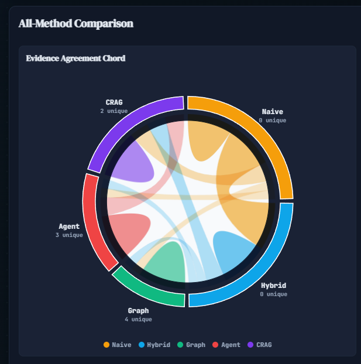
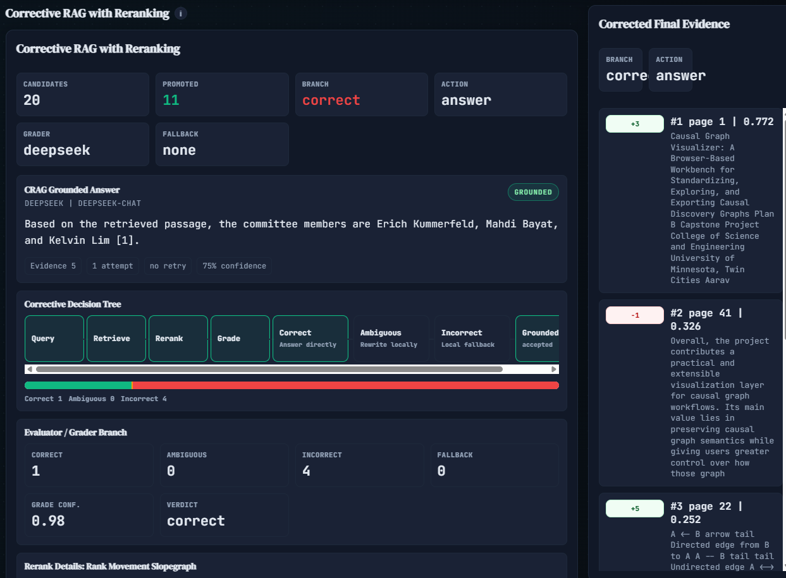
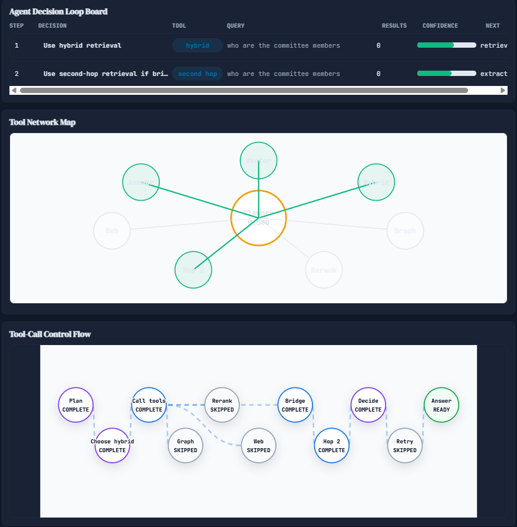
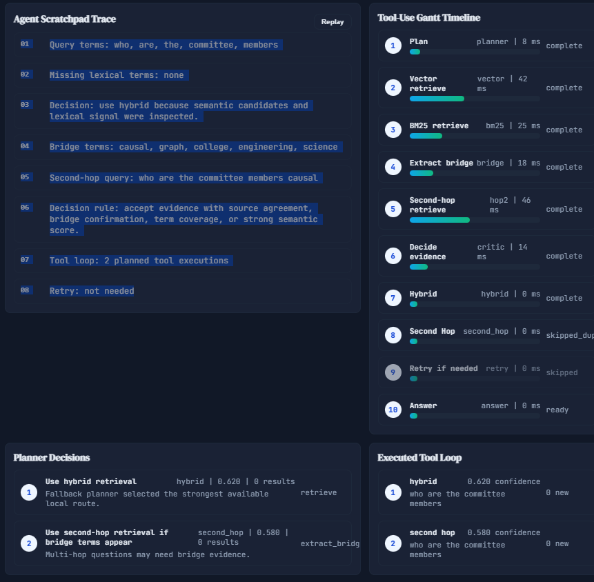
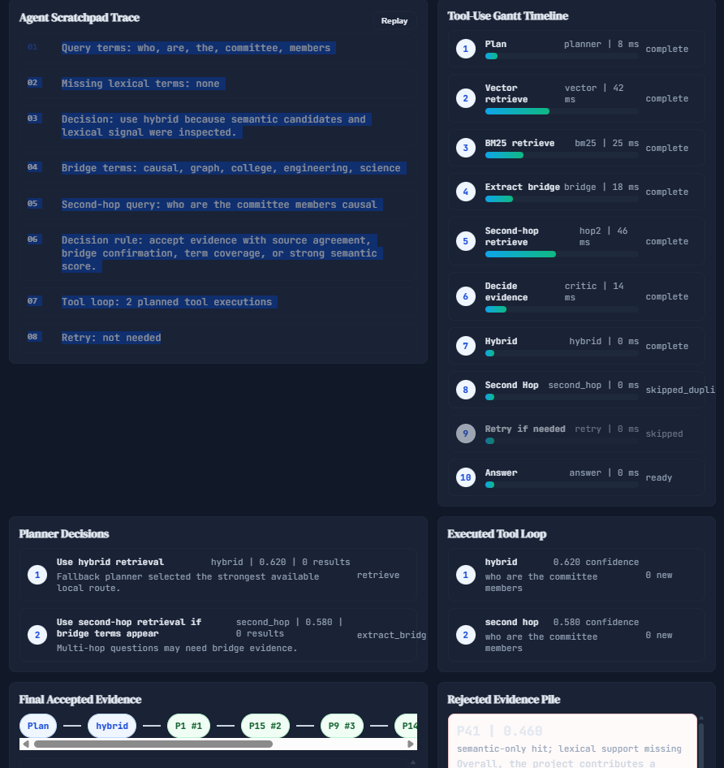

# RAG Evidence Lab

**A small research workbench for comparing how RAG systems find, judge, and explain evidence.**

RAG Evidence Lab is a full-stack prototype for studying Retrieval-Augmented Generation on a shared document corpus. You upload a PDF, ask one question, and compare how different RAG architectures retrieve evidence and build an answer.

The project is intentionally visual. It is not trying to be a polished chatbot first. Its main purpose is to make retrieval behavior inspectable: which chunks were selected, which methods agreed, which evidence was promoted or rejected, and where a pipeline needed correction.

An archived copy of the previous README is saved at:

```text
README.old-before-2026-rag-visual-refresh.md
```

## What Changed In This Iteration

The project was cleaned up around **five public methods**:

1. **Naive Vector RAG**
2. **Hybrid RAG**
3. **GraphRAG**
4. **Agentic Multi-hop RAG**
5. **Corrective RAG with Reranking**

Several older public modes were folded into these methods instead of being shown as separate sidebar choices. BM25 is now Hybrid's sparse branch, reranking belongs inside CRAG, and standalone multi-hop is now part of Agentic RAG. Vectorless Markdown was removed from the main project story.

The benchmark pipeline was also updated. HotpotQA evaluation now reports retrieval metrics such as Precision@K, Recall@K, Hit@K, MRR, MAP, and NDCG@K. Optional answer evaluation can add Exact Match, token F1, faithfulness, and answer relevancy.

## Current Methods

| Method | What It Does | What To Look At |
|---|---|---|
| **Naive Vector RAG** | A semantic baseline using embeddings and FAISS similarity search. | Nearest-neighbor map, top-k rings, similarity waterfall, retrieved chunks. |
| **Hybrid RAG** | Combines dense vector search with BM25 sparse retrieval through rank fusion. | Vector/BM25/fused rank lanes, source overlap, final evidence list. |
| **GraphRAG** | Retrieves through entities, relationship triples, communities, and answer subgraphs. | Interactive graph explorer, relationship paths, community summaries, graph score stacks. |
| **Agentic Multi-hop RAG** | Uses structured planner decisions to choose retrieval tools, bridge evidence, and second-hop queries. | Decision loop board, tool network, scratchpad summaries, Gantt timeline, accepted/rejected evidence. |
| **Corrective RAG with Reranking** | Reranks candidates, grades evidence, branches through correction or fallback, and checks groundedness. | Corrective decision tree, grade distribution, rerank movement, grounded answer panel. |

Groundedness checking is deliberately **CRAG-only**. The other methods generate normal evidence-backed answers without critic verdicts or retry metadata.

## Screenshots

### Agentic Multi-hop RAG



Agentic RAG now shows structured reasoning summaries rather than hidden chain-of-thought. The scratchpad describes the visible plan: query terms, missing lexical terms, bridge terms, second-hop query, evidence rule, tool loop count, and retry status.



Planner decisions are kept concise and auditable. The method can use vector, hybrid, graph, rerank, second-hop, web search, and answer tools. Tavily web search is available when `TAVILY_API_KEY` is set, but web calls are not used in default Hotpot benchmark runs.



The tool network map makes the selected route visible. The goal is to show how the agent decided, not to pretend the agent is a black box with a single retrieval step.

### Corrective RAG With Reranking



CRAG now owns reranking, evidence grading, correction, fallback, and groundedness checking. Evidence is graded as correct, ambiguous, or incorrect. Correct evidence answers directly; ambiguous evidence can trigger a local rewrite; incorrect evidence can fall back to web search when Tavily is configured.

### Compare All Methods



The comparison page now uses an evidence agreement chord diagram. Chord thickness reflects shared retrieved chunks between methods, while each method's outer ring shows unique evidence. This is useful for seeing whether methods genuinely converge or merely produce similar-looking answers.

## Backend And Retrieval Updates

- Public modes are now `naive`, `hybrid`, `graph`, `agentic`, and `crag`, plus `compare`.
- BM25, reranking, and multi-hop remain useful internal machinery, but they are no longer standalone public modes.
- Hybrid keeps BM25 as its sparse retrieval branch and combines it with vector retrieval.
- GraphRAG now uses relationship triples, entity/title linking, community detection, community summaries, relationship-path scoring, and graph-first retrieval payloads.
- Agentic RAG has a bounded tool loop with structured decisions, confidence, retries, second-hop retrieval, graph/rerank tools, and optional Tavily web search.
- CRAG now grades the retrieval set, not only individual chunks, and returns branch metadata such as verdict, confidence, missing evidence summary, recommended action, fallback source, and correction attempts.
- The global self-healing critic was removed from non-CRAG methods. CRAG remains the only method that shows groundedness verdicts and answer retry metadata.

## Frontend Updates

The interface was redesigned as a dense research dashboard.

- **Naive** uses a nearest-neighbor lens with top-k rings and a similarity waterfall.
- **Hybrid** uses a three-lane rank-fusion chart for vector rank, BM25 rank, and fused rank.
- **GraphRAG** is graph-first again, with hover focus, click-pinned neighborhoods, zoom controls, transparency for unrelated nodes, relationship paths, score stacks, and community panels.
- **Agentic** shows planner decisions, selected tools, confidence, result counts, and accepted/rejected evidence.
- **CRAG** shows a corrective decision tree, grade distribution, rerank details, fallback source, and grounded final answer.
- **Compare** uses an evidence agreement chord diagram and consensus heatmap.

The latest pass also tightened spacing across the method pages so visual cards have steadier sizes and fewer awkward boundaries.

## Older Methods

These methods are not deleted from the engineering history, but they are no longer public top-level modes:

| Older Mode | Current Status | Why It Was Moved |
|---|---|---|
| **BM25** | Internal helper inside Hybrid and other scoring paths. | BM25 is most useful as the sparse half of Hybrid RAG, not as a separate headline method. |
| **Rerank RAG** | Folded into CRAG. | Reranking is strongest when paired with evidence grading and correction. |
| **Standalone Multi-hop** | Folded into Agentic Multi-hop RAG. | Multi-hop retrieval is clearer when shown as planned tool use with bridge terms and confidence. |
| **Vectorless Markdown** | Removed from the main story. | It was interesting structurally, but it did not fit the final five-method architecture. |

Older screenshots may still exist under `docs/screenshots/`, but the current README focuses on the five-method version of the app.

## Evaluation

The HotpotQA benchmark uses the real Hugging Face dataset:

```text
hotpotqa/hotpot_qa
config: distractor
split: validation
```

The benchmark adapter maps Hotpot supporting facts into the project's chunk schema so retrieval can be scored against gold evidence.

The current metrics include:

- Precision@3, Precision@5, Precision@10
- Recall@3, Recall@5, Recall@10
- Hit@5 and Hit@10
- MRR
- MAP
- NDCG@3, NDCG@5, NDCG@10
- Supporting fact hit count and hit rate
- All supporting facts found

Answer metrics are opt-in:

- Exact Match
- Token F1
- Faithfulness
- Answer relevancy

The default benchmark remains retrieval-only to avoid surprise DeepSeek or Tavily API calls.

### Latest Benchmark Snapshot

This snapshot is from a **100-query HotpotQA validation run** using `top_k=10` across the five public methods. It is retrieval-only: no answer generation, no DeepSeek judging, and no Tavily web search. The run completed with **0 errors** over 500 method-query evaluations.

| Method | Recall@10 | Hit@10 | NDCG@5 | MRR | MAP | All Facts Found |
|---|---:|---:|---:|---:|---:|---:|
| **Hybrid RAG** | **0.7723** | 0.99 | **0.7991** | **0.8510** | **0.5838** | **0.53** |
| **Agentic Multi-hop RAG** | 0.7690 | **1.00** | 0.7857 | 0.8382 | 0.5778 | 0.50 |
| **Corrective RAG with Reranking** | 0.7507 | **1.00** | 0.7908 | 0.8474 | 0.5664 | 0.48 |
| **Naive Vector RAG** | 0.7262 | 0.99 | 0.7241 | 0.7749 | 0.4933 | 0.45 |
| **GraphRAG** | 0.0500 | 0.10 | 0.0246 | 0.0247 | 0.0125 | 0.01 |

Hybrid is the strongest retrieval baseline in this run, while Agentic and CRAG stay close and add more diagnostic behavior. GraphRAG is included honestly as a research-stage implementation: its graph cache and visuals are useful, but its HotpotQA retrieval ranking still needs better entity linking and path scoring before it is competitive.

## Benchmark Commands

The full command list is kept in `HOTPOT_BENCHMARK_COMMANDS.txt`. A short version is:

```powershell
conda activate rag-multimodal
python -m pip install datasets
python benchmarking\hotpot_adapter.py --config distractor --split validation --limit 150
python -m pip uninstall -y datasets pyarrow
python benchmarking\build_hotpot_store.py
python benchmarking\run_hotpot_benchmark.py --limit 150 --modes all --top-k 10
python benchmarking\hotpot_metrics.py
```

For a small smoke run:

```powershell
python benchmarking\run_hotpot_benchmark.py --limit 5 --modes all --top-k 10
python benchmarking\hotpot_metrics.py
```

To include answer generation and LLM-based answer metrics:

```powershell
python benchmarking\run_hotpot_benchmark.py --limit 150 --modes all --top-k 10 --include-answers
python benchmarking\run_hotpot_benchmark.py --limit 150 --modes all --top-k 10 --include-answers --include-llm-metrics
python benchmarking\hotpot_metrics.py
```

## Tech Stack

| Layer | Technology |
|---|---|
| Backend | Flask, FAISS, PyMuPDF, Sentence Transformers, NumPy, pandas, scikit-learn |
| Frontend | React 18, Vite, D3.js, d3-sankey |
| Embeddings | `sentence-transformers/all-MiniLM-L6-v2` |
| Vector Search | FAISS `IndexFlatIP` |
| LLM | DeepSeek Chat API |
| Web Search | Tavily API, optional |
| Benchmarking | HotpotQA adapter, benchmark runner, custom metrics |

## Setup

```powershell
conda create -n rag-multimodal python=3.10 -y
conda activate rag-multimodal
python -m pip install -r requirements.txt

cd frontend
npm install
```

Create a `.env` file in the project root:

```text
DEEPSEEK_API_KEY=your_key_here
TAVILY_API_KEY=your_tavily_key_here
```

`TAVILY_API_KEY` is optional. Without it, Agentic and CRAG continue to run local retrieval tools, and web fallback is reported as unavailable.

For deterministic local testing, external tools can be disabled:

```text
RAG_ALLOW_EXTERNAL_TOOLS=false
```

## Run The App

Terminal 1:

```powershell
conda activate rag-multimodal
C:\Users\aarav\anaconda3\envs\rag-multimodal\python.exe backend.py
```

Terminal 2:

```powershell
cd frontend
npm run dev
```

Open:

```text
http://localhost:5173
```

The backend runs on:

```text
http://127.0.0.1:5000
```

The same commands are listed in `PROJECT_COMMANDS.txt`.

## Project Structure

```text
RAG comparison/
|-- backend.py
|-- README.md
|-- README.old-before-2026-rag-visual-refresh.md
|-- PROJECT_COMMANDS.txt
|-- HOTPOT_BENCHMARK_COMMANDS.txt
|-- docs/
|   |-- RAG_METHOD_ROADMAP.md
|   `-- screenshots/
|-- benchmarking/
|   |-- hotpot_adapter.py
|   |-- build_hotpot_store.py
|   |-- run_hotpot_benchmark.py
|   `-- hotpot_metrics.py
|-- frontend/
|   |-- package.json
|   |-- vite.config.mjs
|   `-- src/
|       |-- App.jsx
|       |-- styles.css
|       `-- components/
|-- notebooks/
`-- data/
```

## Notes

- GraphRAG is much stronger than the first lightweight version, but it is still a practical research implementation rather than a full heavyweight GraphRAG system.
- Agentic RAG shows structured decision summaries only. It does not expose hidden chain-of-thought.
- CRAG is the only method with groundedness verdicts because correction is part of that method's purpose.
- Tavily web search is interactive infrastructure, not part of default benchmark retrieval.
- This is a local research prototype for method comparison and interpretability.

## License

MIT
