# RAG Evidence Lab

**Comparative Retrieval-Augmented Generation Diagnostics**

RAG Evidence Lab is a full-stack research prototype for comparing Retrieval-Augmented Generation (RAG) methods on the same PDF corpus. The goal is not just to return an answer, but to show how the answer was supported. A user can upload a PDF, build one shared document index, ask a question, and then inspect how different retrieval strategies selected evidence.

The project also includes a HotpotQA benchmark pipeline. This gives the work a more formal evaluation setting because HotpotQA contains multi-hop questions with gold supporting facts.

## Main Contributions

- Implements 8 RAG retrieval modes in one application.
- Uses one shared corpus store, so the methods are compared on the same chunks.
- Adds self-healing answer generation with a critic step that checks whether the response is grounded in retrieved evidence.
- Builds visual diagnostics for each method instead of using a plain chatbot interface.
- Includes a real HotpotQA adapter and benchmark runner for retrieval evaluation.
- Reports standard retrieval metrics such as NDCG, Recall, Precision, MRR, MAP, and supporting fact hit rate.

## Methods Implemented

| # | Method | Main Idea |
|---|--------|-----------|
| 1 | **Naive Vector RAG** | Uses SentenceTransformer embeddings and FAISS semantic search. |
| 2 | **BM25 Lexical Retrieval** | Uses exact query-term matching, inverse document frequency, and term-level highlights. |
| 3 | **Hybrid RAG** | Combines vector and BM25 candidates with rank fusion. |
| 4 | **Rerank RAG** | Retrieves a wider candidate set and reranks it with lexical-semantic features. |
| 5 | **GraphRAG-lite** | Builds lightweight entity and section links, then retrieves through graph traversal. |
| 6 | **Vectorless Markdown RAG** | Uses document structure and section navigation instead of embeddings. |
| 7 | **Agentic RAG** | Simulates a plan, retrieve, critique, and retry workflow. |
| 8 | **Multi-hop RAG** | Extracts bridge terms and performs hop-by-hop retrieval. |

## Screenshots

The screenshots below show the current frontend after all methods are run on the same PDF and query. They are included because the main contribution of this project is the evidence inspection interface, not only the backend retrieval code.

### Full Interface

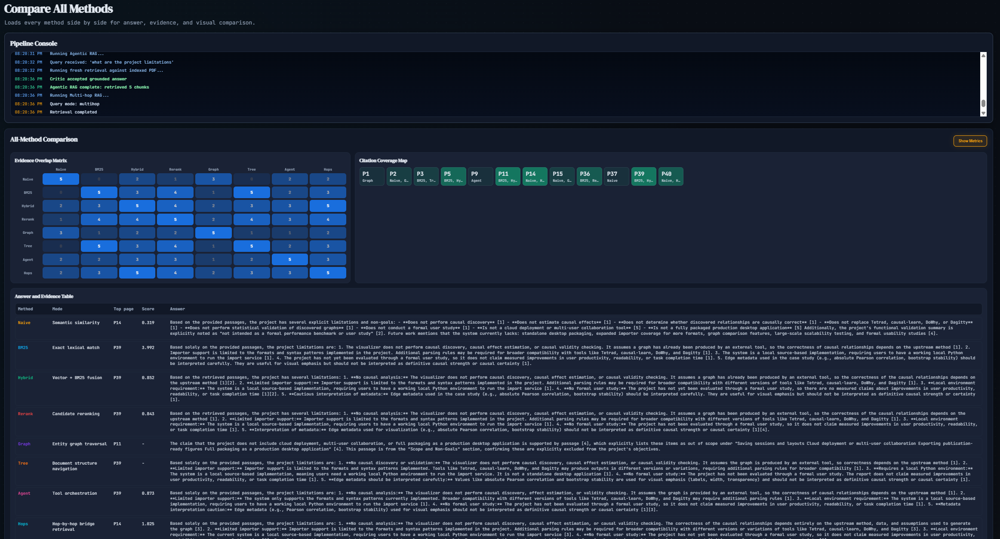

The main workspace keeps the selected retrieval method, pipeline console, PDF upload, question input, and diagnostics on one screen. This helped me compare retrieval behavior without switching between separate notebooks.

### Method Comparison

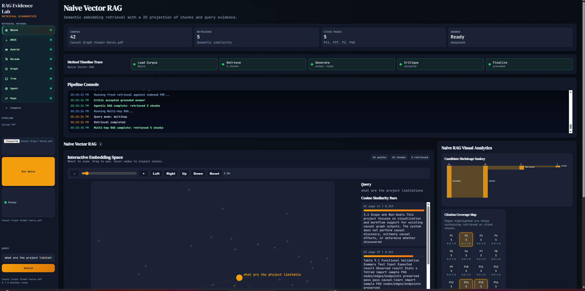

The comparison view runs all methods for the same question and shows evidence overlap, citation coverage, and answer differences. This is useful for seeing whether methods agree on the same pages or find different support.

### Naive Vector RAG

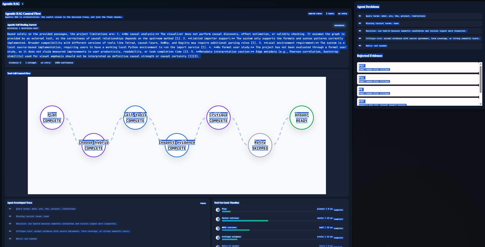

Naive vector retrieval shows a 2D embedding projection, retrieved chunks, cosine similarity bars, and citation coverage. This makes the semantic search baseline easier to inspect than a list of top-k chunks.

### BM25 Lexical Retrieval

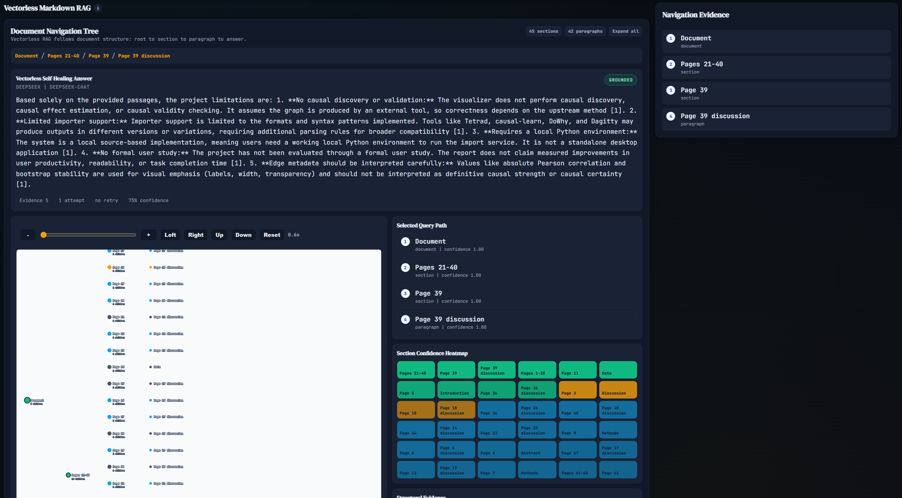

BM25 focuses on exact lexical evidence. The interface highlights query terms inside retrieved chunks, shows missing query-term warnings, and gives term rarity bars so the user can see why a chunk scored highly.

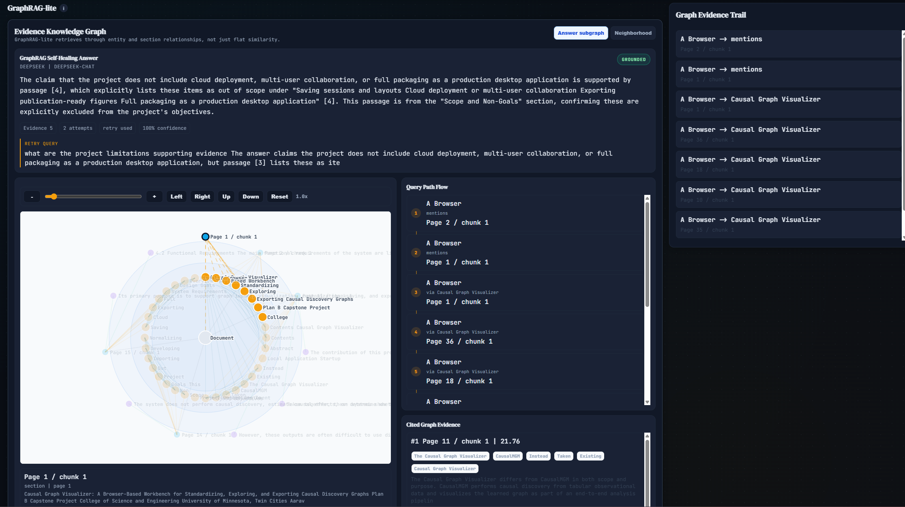

### Hybrid RAG

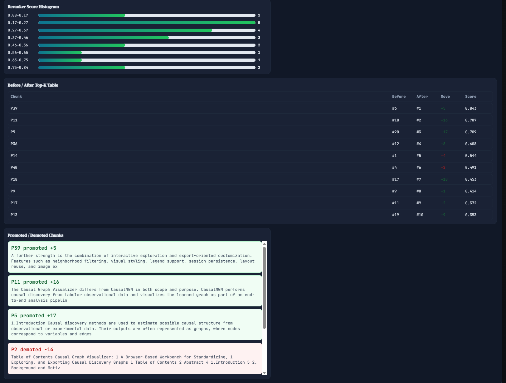

Hybrid retrieval merges vector and BM25 candidates. The overlap matrix and rank-fusion views show which chunks came from semantic search, lexical search, or both.

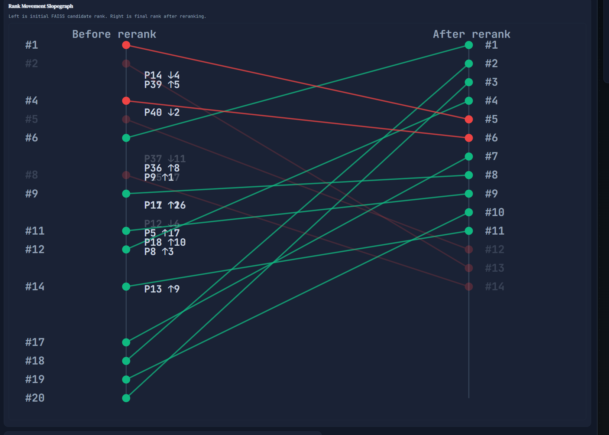

### Rerank RAG

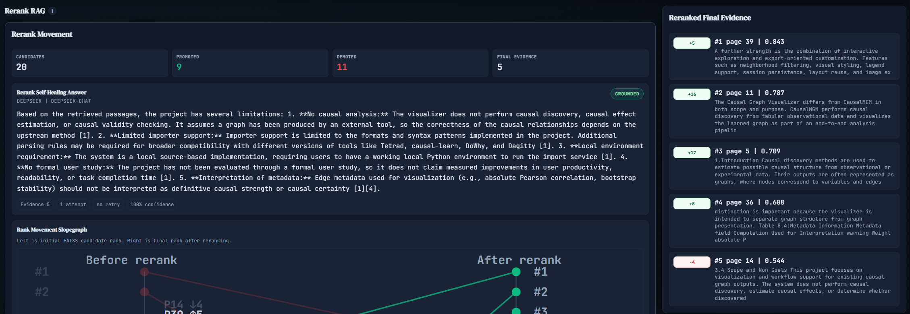

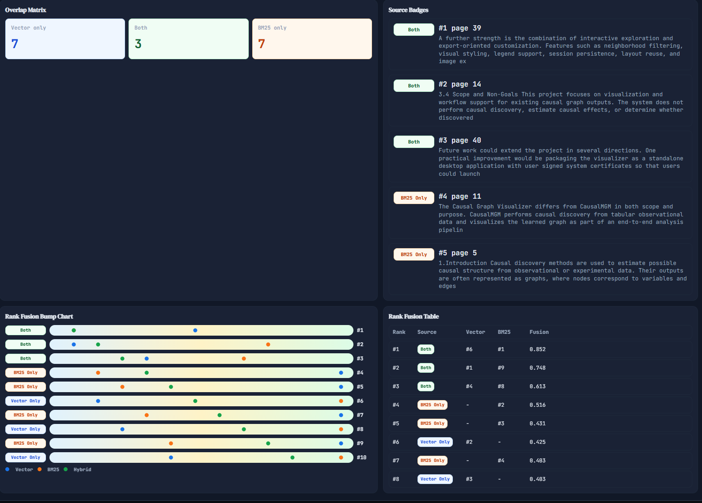

The rerank view shows how candidate chunks move after reranking. Promoted and demoted chunks are shown explicitly, which makes the reranker less of a hidden scoring step.

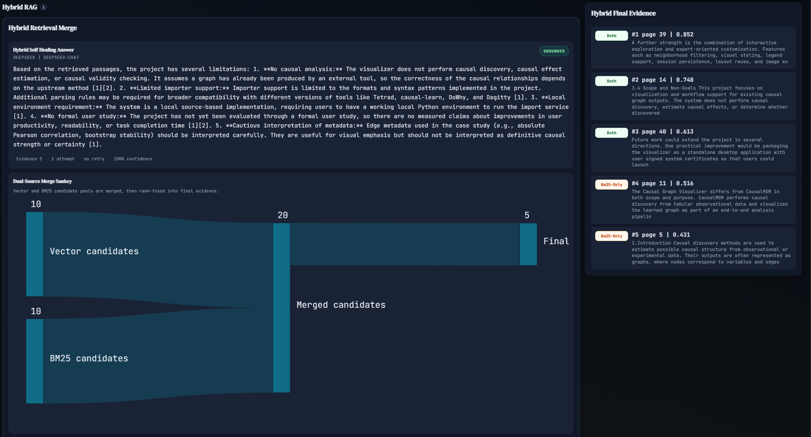

### GraphRAG-lite

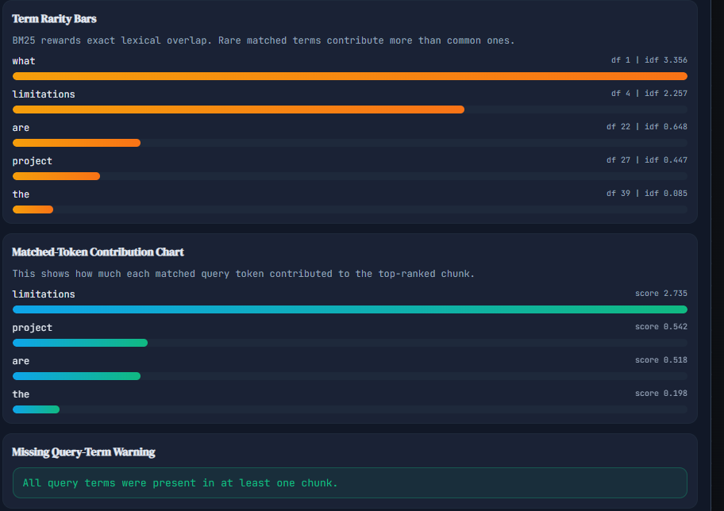

GraphRAG-lite builds a lightweight evidence graph from entities, sections, and claims. The view shows the answer subgraph and the graph evidence trail used for the generated response.

### Vectorless Markdown RAG

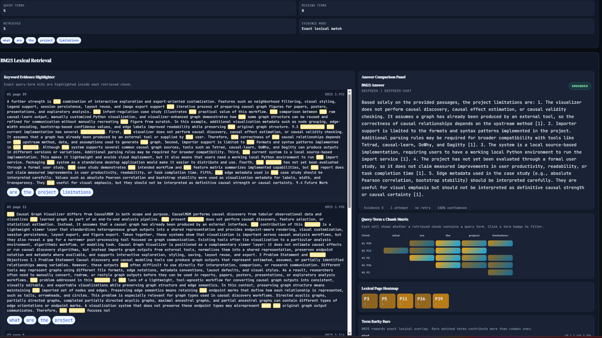

Vectorless Markdown RAG follows the document structure instead of embedding similarity. The document tree, selected path, and section confidence heatmap show how the system moved from document-level structure to answer evidence.

### Agentic RAG

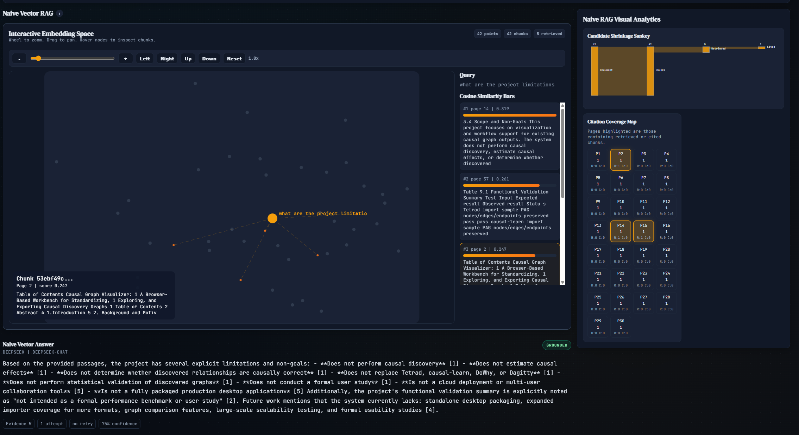

Agentic RAG shows the decision trace: planning, tool calls, evidence inspection, critique, and retry status. This view is meant to make the agent workflow auditable instead of only showing the final answer.

## Self-Healing Answer Generation

Each query can produce an answer from the retrieved chunks. The answer is then passed through a critic stage. The critic checks whether the answer is grounded in the retrieved evidence. If the answer is weakly supported, the system can retry retrieval with a reformulated query or fall back to a safer response.

This matters because a RAG system can still hallucinate after retrieval. In this project, the answer panel shows the answer, critic verdict, evidence count, retry information, confidence, and unsupported-claim notes when available.

## Frontend Visualizations

The frontend is a retrieval diagnostics interface rather than a minimal chatbot.

- **Naive Vector RAG**: embedding space, zoom/pan controls, similarity bars, citation coverage, and answer panel.
- **BM25**: evidence highlighter, query-term by chunk matrix, lexical page heatmap, term rarity bars, and missing-term warnings.
- **Hybrid**: vector/BM25 overlap views, source badges, rank-fusion bump chart, and fusion table.
- **Rerank**: candidate movement summary, slopegraph, score histogram, promoted/demoted chunks, and final evidence list.
- **GraphRAG-lite**: evidence graph, answer subgraph, neighborhood view, query-path flow, and cited graph evidence.
- **Vectorless Markdown**: document tree, selected path, section confidence heatmap, and structural evidence panel.
- **Agentic RAG**: tool-call control flow, scratchpad trace, Gantt-style tool timeline, accepted evidence, and rejected evidence.
- **Multi-hop RAG**: bridge terms, hop queries, bridge evidence table, and final multi-hop evidence.
- **Compare All**: runs all methods for the same question and shows answer and evidence differences side by side.

## HotpotQA Benchmark

The benchmark pipeline uses the real Hugging Face dataset:

```text
hotpotqa/hotpot_qa
config: distractor
split: validation
```

The adapter converts HotpotQA examples into the same chunk schema used by the app. Each supporting fact is mapped to a relevant chunk ID, so retrieval can be evaluated against gold evidence instead of synthetic labels.

### Latest 150-Query Benchmark

This run used 150 HotpotQA validation questions, 6,111 chunks, top-k = 10, and all 8 retrieval modes. The run produced 1,200 query-mode rows and had 0 runner errors.

| Rank | Mode | NDCG@5 | Recall@5 | Recall@10 | MRR | MAP | Supporting Fact Hit Rate | All Facts Found |
|---:|---|---:|---:|---:|---:|---:|---:|---:|
| 1 | Rerank | 0.8249 | 0.6647 | 0.7421 | 0.8727 | 0.5762 | 0.7421 | 0.4733 |
| 2 | Hybrid | 0.8028 | 0.6649 | 0.7532 | 0.8436 | 0.5668 | 0.7532 | 0.4933 |
| 3 | Agentic | 0.7936 | 0.6552 | 0.7527 | 0.8421 | 0.5661 | 0.7527 | 0.4733 |
| 4 | Vectorless | 0.7893 | 0.6427 | 0.7499 | 0.8513 | 0.5726 | 0.7499 | 0.4733 |
| 5 | BM25 | 0.7868 | 0.6427 | 0.7499 | 0.8480 | 0.5709 | 0.7499 | 0.4733 |
| 6 | Multi-hop | 0.7482 | 0.6500 | 0.7504 | 0.7776 | 0.5322 | 0.7504 | 0.4933 |
| 7 | Naive Vector | 0.7090 | 0.5836 | 0.7019 | 0.7453 | 0.4717 | 0.7019 | 0.4133 |
| 8 | GraphRAG-lite | 0.2808 | 0.2150 | 0.3183 | 0.2905 | 0.1668 | 0.3183 | 0.1200 |

The strongest method in this run was **Rerank RAG**, which had the best NDCG@5, MRR, and MAP. Hybrid and Agentic were close behind. GraphRAG-lite performed poorly in this benchmark, which suggests that the current lightweight graph construction does not yet match HotpotQA's sentence-level supporting fact structure.

## Tech Stack

| Layer | Technology |
|---|---|
| Backend | Flask, FAISS, PyMuPDF, Sentence Transformers, NumPy, pandas, scikit-learn |
| Frontend | React 18, Vite, D3.js, d3-sankey |
| Embeddings | `sentence-transformers/all-MiniLM-L6-v2` |
| Vector Search | FAISS `IndexFlatIP` |
| LLM | DeepSeek Chat API |
| Benchmarking | HotpotQA adapter, custom runner, custom metrics script |

## Getting Started

### Prerequisites

- Python with conda
- Node.js 18+
- DeepSeek API key for answer generation and critic mode

### Setup

```powershell
conda create -n rag-multimodal python=3.10 -y
conda activate rag-multimodal
python -m pip install -r requirements.txt

cd frontend
npm install
```

Create a `.env` file in the project root:

```text
DEEPSEEK_API_KEY=your_key_here
```

### Run the App

Terminal 1:

```powershell
conda activate rag-multimodal
C:\Users\aarav\anaconda3\envs\rag-multimodal\python.exe backend.py
```

Terminal 2:

```powershell
cd frontend
npm run dev
```

Then open:

```text
http://localhost:5173
```

The backend runs on:

```text
http://127.0.0.1:5000
```

The same commands are also listed in `PROJECT_COMMANDS.txt`.

## HotpotQA Benchmark Commands

The project keeps the full benchmark commands in `HOTPOT_BENCHMARK_COMMANDS.txt`. A short version is:

```powershell
conda activate rag-multimodal
python -m pip install datasets
python benchmarking\hotpot_adapter.py --config distractor --split validation --limit 150
python -m pip uninstall -y datasets pyarrow
python benchmarking\build_hotpot_store.py
python benchmarking\run_hotpot_benchmark.py --limit 150 --modes all --top-k 10
python benchmarking\hotpot_metrics.py
```

The `datasets` and `pyarrow` packages are kept out of the main runtime requirements because they caused instability in this local environment when combined with the embedding stack.

## Project Structure

```text
RAG comparison/
|-- backend.py
|-- requirements.txt
|-- PROJECT_COMMANDS.txt
|-- HOTPOT_BENCHMARK_COMMANDS.txt
|-- docs/
|   `-- screenshots/
|-- benchmarking/
|   |-- PLAN.md
|   |-- hotpot_adapter.py
|   |-- build_hotpot_store.py
|   |-- run_hotpot_benchmark.py
|   `-- hotpot_metrics.py
|-- backend_or_exports/
|   `-- current_corpus/
|-- notebooks/
|   |-- shared_rag_store.py
|   |-- 00_build_faiss_corpus.py
|   |-- 01_naive_vector_rag.py
|   |-- 02_bm25_lexical_rag.py
|   `-- 03_hybrid_rag.py
|-- frontend/
|   |-- package.json
|   |-- vite.config.mjs
|   `-- src/
|       |-- App.jsx
|       |-- styles.css
|       |-- lib/
|       `-- components/
|           |-- AnswerCriticPanel.jsx
|           |-- EmbeddingConstellation.jsx
|           |-- Bm25Analytics.jsx
|           |-- HybridAnalytics.jsx
|           |-- RerankAnalytics.jsx
|           |-- GraphRagAnalytics.jsx
|           |-- VectorlessMarkdownAnalytics.jsx
|           |-- AgenticRagAnalytics.jsx
|           |-- MultiHopRagAnalytics.jsx
|           |-- MethodComparison.jsx
|           `-- ConsolePanel.jsx
`-- data/
```

## Evaluation Metrics

The HotpotQA metrics script computes:

- NDCG@3, NDCG@5, NDCG@10
- Recall@3, Recall@5, Recall@10
- Precision@3, Precision@5, Precision@10
- MRR
- MAP
- supporting fact hit count
- supporting fact hit rate
- all supporting facts found

These are retrieval metrics. They measure whether the system retrieved the gold supporting evidence, not whether the generated answer text is semantically correct.

## Notes and Limitations

- The current benchmark uses sentence-level HotpotQA chunks, which is useful for evidence evaluation but different from long PDF paragraph retrieval.
- GraphRAG-lite is intentionally lightweight and does not yet perform deep graph construction or community summarization.
- The self-healing critic improves answer safety, but retrieval quality still depends on the corpus, chunking, and selected mode.
- The frontend is designed for interpretability and comparison, not minimal chatbot interaction.
- This is a local research prototype. It is not packaged as a production desktop application or cloud service.

## License

MIT
